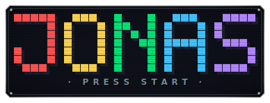
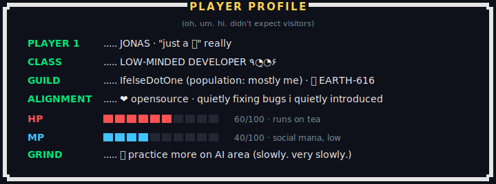
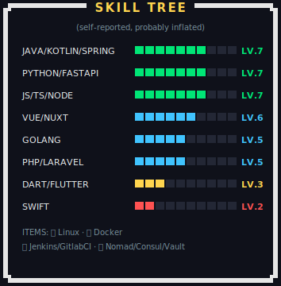
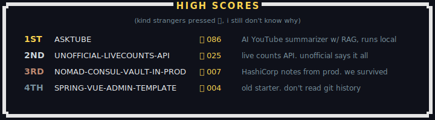

**`▶ press start... i mean, only if you want to ◀`**

🌜 *Ein gebildeter Geist ist fokussierte Seele; Kaffee kann nicht mithalten, Wissen spielt die Hauptrolle*

 

 

## `💾 CONTINUE?`

`[ YES ]` `[ IT'S OK IF NOT ]`

**`🪙 insert coin? (no pressure. tea is fine too.)`**

---

## `🗺️ HUB WORLD — jonaskahn.github.io/jonaskahn`

**Jonas Kahn** (`jonaskahn`) — builds **AI systems** and the plumbing around them: **agents, RAG pipelines, orchestration**, and the unglamorous infrastructure that keeps it all standing. Open source maker of [Cadence](https://github.com/jonaskahn/cadence) (multi-agent AI orchestration platform), [AskTube](https://github.com/jonaskahn/asktube) (AI-powered YouTube summarizer with RAG), [EasyKey](https://github.com/jonaskahn/EasyKey) (Vietnamese input switcher for macOS) and more.

This repo also hosts the personal site → **[jonaskahn.github.io/jonaskahn](https://jonaskahn.github.io/jonaskahn/)**

| File | Purpose |
| --- | --- |
| `index.html` | single-page portfolio, SEO-optimized (Open Graph, Twitter Card, JSON-LD, canonical) |
| `style.css` | all styles — black/white/red, Futura, scroll reveals |
| `script.js` | session uptime timer + IntersectionObserver reveals |
| `robots.txt` / `sitemap.xml` | crawler directives + sitemap |
| `.github/workflows/deploy-pages.yml` | CI — builds & deploys to GitHub Pages on every push to `main` |

**Deploy flow:** push to `main` → GitHub Actions copies site files to `dist/` → uploads Pages artifact → `actions/deploy-pages` publishes it. No `gh-pages` branch needed.
